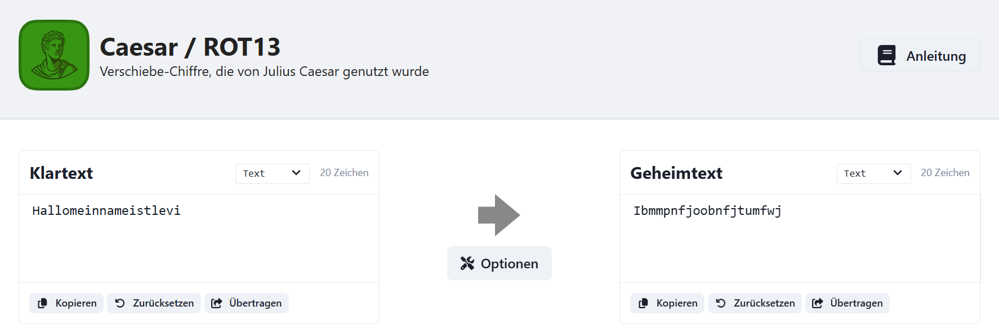

# Erklärung meiner Tätigkeiten im Projekt: Verschlüsselung und Entschlüsselung von Nachrichten

## 1. Einführung in die Thematik  
Zu Beginn des Projekts habe ich mich intensiv mit den Grundlagen der Verschlüsselung befasst. Dabei bin ich auf die Caesar- und Vigenère-Verschlüsselung eingegangen. Zwei erklärende Videos haben mir dabei geholfen:  
- Ein Video zur **Caesar-Verschlüsselung** (ca. 15 Minuten).  
- Ein Video zur **Vigenère-Verschlüsselung** (ca. 8 Minuten).  

Diese Einführung hat mir ein grundlegendes Verständnis vermittelt, wie Verschlüsselungstechniken funktionieren und warum sie eine bedeutende Rolle spielen.

---

## 2. Umsetzung: Verschlüsseln von Nachrichten  

### 1. Auswahl der Nachricht  
Für die Verschlüsselung habe ich die folgende Nachricht als Klartext (plaintext) ausgewählt:  
`ErfolghatdreiBuchstabenTUNJohannWolfgangvonGoethe`  

Das Zitat betont die Bedeutung des eigenen Handelns für den Erfolg, was ich als inspirierend für die Aufgabe empfand.

### 2. Nutzung von CrypTool-Online  
Ich habe die Website **CrypTool-Online Caesar** genutzt, um meine Nachricht zu verschlüsseln. Dazu habe ich die Klartextnachricht in das Eingabefeld des Tools eingefügt.

### 3. Festlegung des Schlüssels  
Für die Verschlüsselung habe ich einen Schlüssel mit dem Wert **5** gewählt. Dieser verschiebt jeden Buchstaben im Alphabet um fünf Positionen nach rechts.

### 4. Verschlüsselung der Nachricht  
Mit dem ausgewählten Schlüssel erzeugte das Tool die verschlüsselte Nachricht (Geheimtext/ciphertext):  
`JwktqlmfyiwjnGzhmxyfgjsYZSOtmfssbtqklfslAtsLtjymj`

### 5. Weitergabe der verschlüsselten Nachricht  
Den Geheimtext habe ich anschließend an einen Klassenkameraden weitergeleitet, der gemäß der Klassenliste nach mir eingetragen ist.

---

## 3. Umsetzung: Entschlüsseln von Nachrichten  

### 1. Empfang der Nachricht  
Ich habe die verschlüsselte Nachricht von meinem Vorgänger in der Klassenliste erhalten. Mein Ziel war es, diese eigenständig zu entschlüsseln.

### 2. Einsatz von CrypTool2  
Zum Entschlüsseln habe ich **CrypTool2** verwendet. Dabei habe ich mich mit den verschiedenen Funktionen des Programms vertraut gemacht, darunter:  
- **Buchstabenhäufigkeitsanalyse**  
- **Brute-Force-Methode** (Durchprobieren aller möglichen Schlüsselwerte).

### 3. Erfolgreiches Finden des Schlüssels  
Nach einigen Versuchen gelang es mir, den korrekten Schlüssel zu ermitteln und die Nachricht erfolgreich zu entschlüsseln. Diese Erfahrung hat mir verdeutlicht, dass die Caesar-Verschlüsselung zwar eine einfache Methode ist, jedoch mit modernen Werkzeugen leicht zu knacken.

