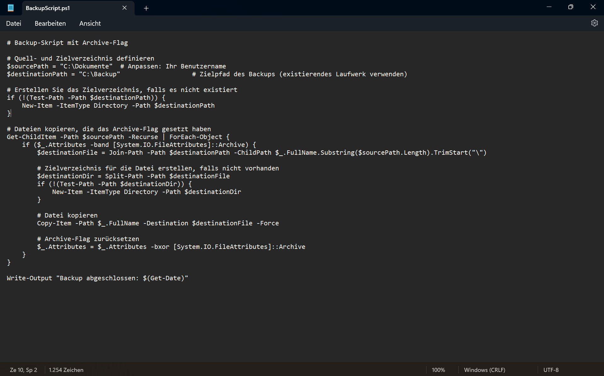
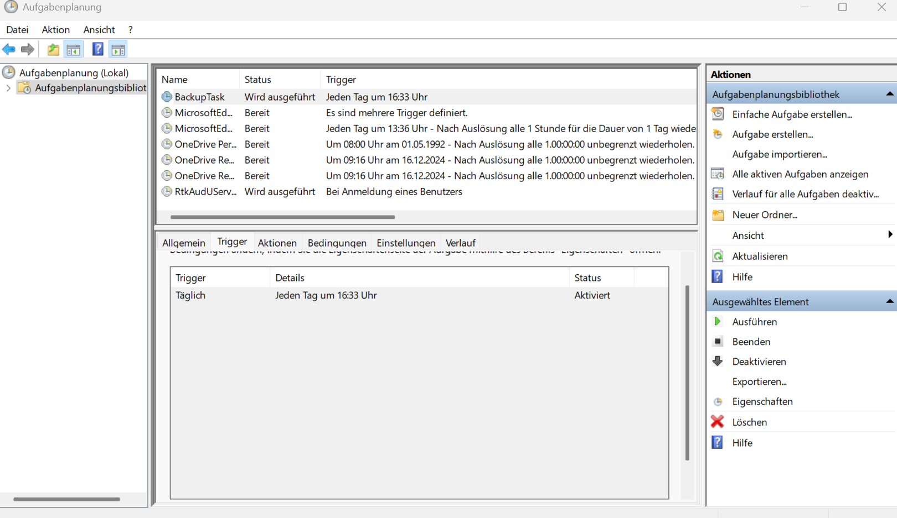
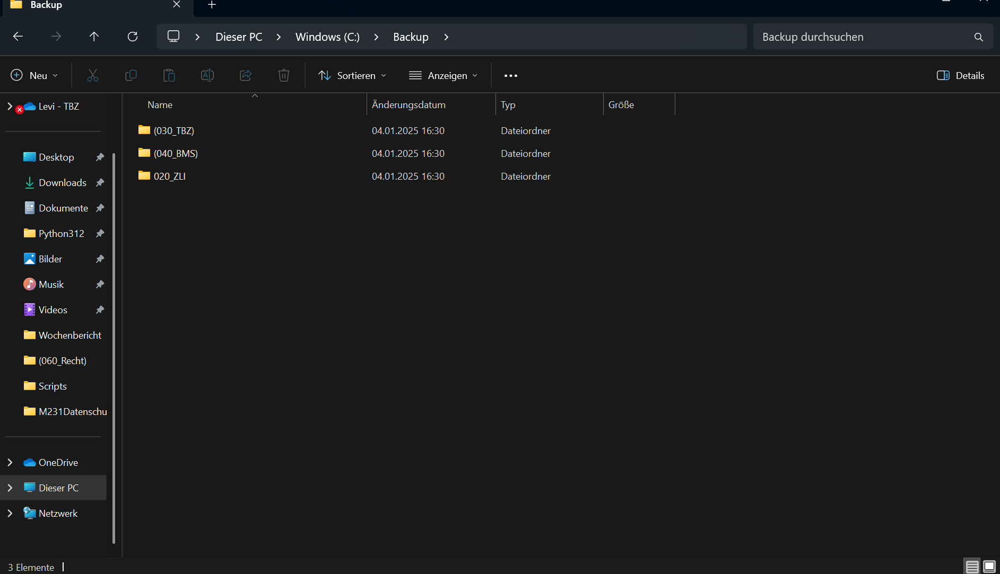

# Automatisiertes Backup mit PowerShell und Aufgabenplanung

## 1. Skript erstellen
1. Öffnen Sie einen Texteditor (z. B. Notepad).
2. Kopieren Sie den folgenden Code und fügen Sie ihn ein:

```powershell
# Backup-Skript mit Archive-Flag

# Quell- und Zielverzeichnis definieren
$sourcePath = "C:\Dokumente"  # Anpassen: Ihr Benutzername
$destinationPath = "C:\Backup"                   # Zielpfad des Backups (existierendes Laufwerk verwenden)

# Erstellen Sie das Zielverzeichnis, falls es nicht existiert
if (!(Test-Path -Path $destinationPath)) {
    New-Item -ItemType Directory -Path $destinationPath
}

# Dateien kopieren, die das Archive-Flag gesetzt haben
Get-ChildItem -Path $sourcePath -Recurse | ForEach-Object {
    if ($_.Attributes -band [System.IO.FileAttributes]::Archive) {
        $destinationFile = Join-Path -Path $destinationPath -ChildPath $_.FullName.Substring($sourcePath.Length).TrimStart("\")
        
        # Zielverzeichnis für die Datei erstellen, falls nicht vorhanden
        $destinationDir = Split-Path -Path $destinationFile
        if (!(Test-Path -Path $destinationDir)) {
            New-Item -ItemType Directory -Path $destinationDir
        }

        # Datei kopieren
        Copy-Item -Path $_.FullName -Destination $destinationFile -Force

        # Archive-Flag zurücksetzen
        $_.Attributes = $_.Attributes -bxor [System.IO.FileAttributes]::Archive
    }
}

Write-Output "Backup abgeschlossen: $(Get-Date)"
```

3. Speichern Sie die Datei unter:  
   `C:\Scripts\BackupScript.ps1`

   

---

## 2. Skript testen
1. Öffnen Sie PowerShell als Administrator.
2. Führen Sie das Skript aus:
   ```powershell
   C:\Scripts\BackupScript.ps1
   ```
3. Überprüfen Sie:
   - Ob das Verzeichnis `C:\Backup` erstellt wurde.
   - Ob die Dateien aus `C:\Dokumente` in das Verzeichnis `C:\Backup` kopiert wurden.

---

## 3. Automatisieren mit der Windows Aufgabenplanung

### Windows Aufgabenplanung öffnen:
1. Drücken Sie `Win + S`.
2. Suchen Sie nach **"Aufgabenplanung"** und öffnen Sie die App.

### Neue Aufgabe erstellen:
1. Klicken Sie auf **"Aufgabe erstellen"**.
2. Geben Sie der Aufgabe einen Namen, z. B. **"BackupTask"**.

### Trigger einrichten:
1. Wechseln Sie zur Registerkarte **"Trigger"**.
2. Klicken Sie auf **"Neu"**, und richten Sie den Zeitplan ein (z. B. **täglich um 16:33 Uhr**).



### Aktion hinzufügen:
1. Wechseln Sie zur Registerkarte **"Aktionen"**.
2. Klicken Sie auf **"Neu"**, wählen Sie **"Programm starten"**, und geben Sie Folgendes ein:
   - **Programm/Skript:** `powershell.exe`
   - **Argumente:** 
     ```plaintext
     -File "C:\Scripts\BackupScript.ps1"
     ```

### Optionen anpassen:
1. Wechseln Sie zur Registerkarte **"Bedingungen"**.
2. Deaktivieren Sie **"Aufgabe nur starten, wenn Computer im Netzbetrieb ausgeführt wird"**, falls Sie ein Laptop nutzen.

### Speichern und aktivieren:
1. Klicken Sie auf **OK**.
2. Bestätigen Sie die Aufforderung mit Administratorrechten.

---

## 4. Überprüfen
1. Warten Sie auf die Ausführung des geplanten Tasks oder starten Sie ihn manuell in der Aufgabenplanung.
2. Überprüfen Sie den Zielordner (`C:\Backup`) auf die gesicherten Dateien.
